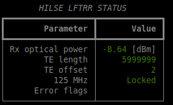
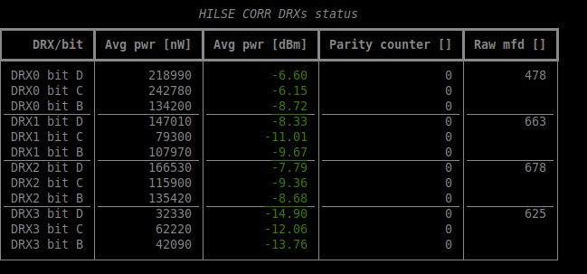

# alma-hilse

ALMA Hardware-In-the-Loop Simulation Environment monitoring and testing package

The `alma-hilse` package provides a set of commands and libraries aiming to help in the setup, monitoring and testing of the ALMA HILSE infrastructure.

## Installation

    pip install alma-hilse

## Installation for development

    git clone ssh://git@bitbucket.sco.alma.cl:7999/esg/alma-hilse.git
    make venv
    source venv/bin/activate
    alma-hilse --help

## Usage

Following is non-exhaustive list of available commands, for illustrative purposes only. Use the following command for all available options:

    alma-hilse --help

### Timing-related commands

    alma-hilse timing --help
    alma-hilse timing status # LORR/LFTRR status for HILSE
    alma-hilse timing resync # LORR/LFTRR resync to CLO reference

### Correlator-related commands
    alma-hilse corr --help
    alma-hilse corr status # power, parity and delay status of DRXs
    alma-hilse corr set-metaframe-delays # NOT IMPLEMENTED YET
    alma-hilse corr mute-edfa # NOT IMPLEMENTED YET
    alma-hilse corr eeprom-read # NOT IMPLEMENTED YET
    alma-hilse corr eeprom-write # NOT IMPLEMENTED YET

### General environment setup and troubleshooting commands
    alma-hilse utils --help
    alma-hilse utils get-devices # list devices connected to ABM
    alma-hilse utils turn-on-ambmanager
